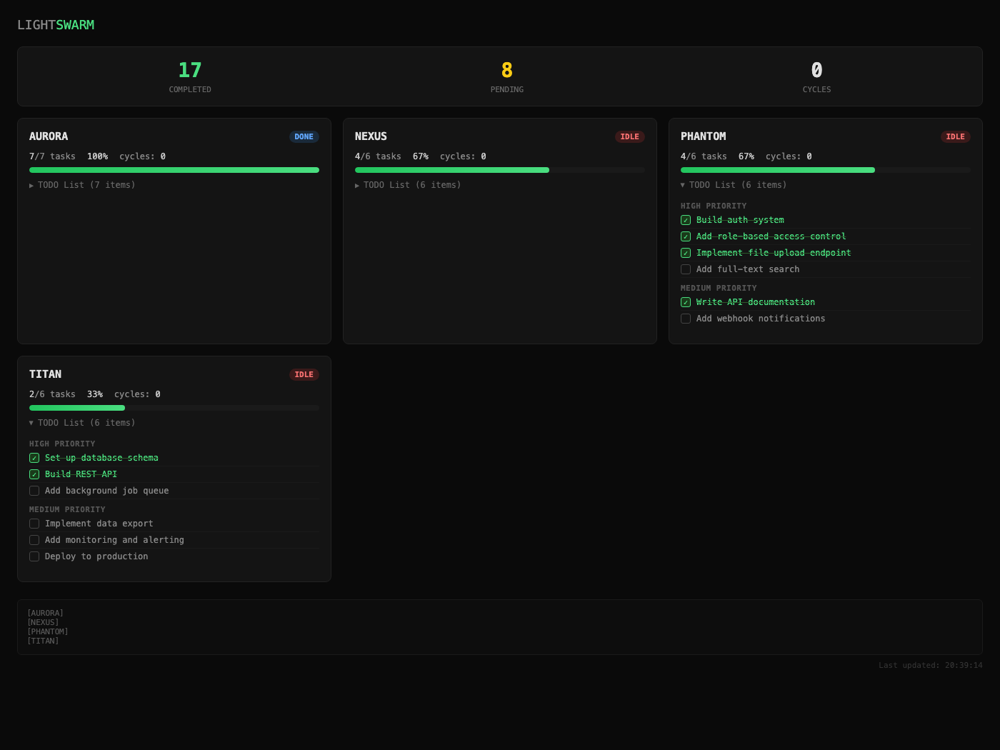

# LIGHTSWARM

### An AI swarm for [Claude Code](https://docs.anthropic.com/en/docs/claude-code) + the Max subscription. Automate your TODO lists across multiple projects without racking up API charges. Zero extra costs. Just your Max sub doing work.

<p align="center">
  
  <br>
  <em>This is how you should look using it. Office not included.</em>
</p>

LIGHTSWARM is a lightweight task pipeline that uses Claude Code CLI to chew through your project TODO lists automatically. Three agents take turns: one picks a task, one builds it, one reviews it. Rinse and repeat.

It runs entirely through your **Claude Code Max subscription** - the same flat-rate plan you're already paying for. No API keys, no per-token billing, no surprise invoices. The `claude` CLI on Max gives you unlimited usage, and LIGHTSWARM just automates what you'd normally do by hand in the terminal. Same CLI, same auth, same plan. The swarm doesn't use any special route or secret API - it literally calls `claude --print` in a loop. If you can use Claude Code, you can run the swarm. For free. Well, "included in what you already pay for" free.

```
ARCHITECT  -->  BUILDER  -->  JANITOR
(pick task)    (implement)   (QA + mark done)
```

---

## How you actually use it

You control everything from your main Claude Code session. That's the command center. From there you can:

- **Launch the swarm** on any project: `./lightswarm my-project`
- **Update TODOs** by editing `TODO.md` directly - the swarm picks up changes on next run
- **Pause work** by just... not running it. Or tell Claude to skip a task. There's no background daemon to kill.
- **Check reports** by reading `.swarm/build_report.md` in any project
- **Monitor everything** on the localhost dashboard (see below)

The key thing: **code is never committed automatically**. The swarm writes code, but you review and commit it yourself. `git diff`, check the changes, commit what you like. The janitor runs tests and flags issues, but the final call is always yours.

---

## The monitoring page

Fire up the dashboard and keep it open in a tab. It auto-refreshes every 5 seconds with live progress across all your projects.

```bash
python3 dashboard_server.py    # http://localhost:7777
```

<p align="center">
  
  <br>
  <em>The monitoring page. Expandable TODO checklists, progress bars, live status. Localhost vibes.</em>
</p>

- Progress bars per project
- Expandable TODO checklists with checkmarks (read-only)
- Pipeline status badges (RUNNING / DONE / IDLE)
- Live log feed at the bottom
- Auto-discovers projects, no config needed

---

## Requirements

- [Claude Code CLI](https://docs.anthropic.com/en/docs/claude-code) installed and authenticated
- **Claude Max subscription** (the whole point - no API costs)
- Bash (macOS/Linux)
- Python 3 (dashboard only)

## Quick start

```bash
git clone https://github.com/craftfortress/lightswarm.git
cd lightswarm

cp .env.example .env
# Edit .env - point LIGHTSWARM_PROJECTS_DIR at your projects folder

chmod +x lightswarm lightswarm-status

# Run on one project
./lightswarm my-project

# Run on everything
./lightswarm --all --force

# Check status in terminal
./lightswarm-status
```

## Adding projects

1. Drop a `TODO.md` in your project root
2. Either set `LIGHTSWARM_PROJECTS_DIR` to your projects folder, or symlink in:
   ```bash
   ln -s /path/to/my-project projects/my-project
   ```
3. `./lightswarm my-project` and walk away

### TODO.md format

Use whatever feels right. Both work:

**Heading style** (good for chunky tasks):

```markdown
## HIGH PRIORITY

### Add user authentication

**Status**: PENDING
**Priority**: HIGH

Email + password auth with bcrypt and JWT.

---

### Fix that annoying layout bug

**Status**: PENDING
**Priority**: HIGH

Hero section overflows on mobile.
```

**Checkbox style** (quick and dirty):

```markdown
- [ ] Add user authentication
- [ ] Fix that annoying layout bug
- [x] Set up database schema
```

The architect picks the highest priority pending task. The janitor marks it done matching your file's convention.

## The three agents

| Agent | Job | Reads | Writes |
|---|---|---|---|
| **ARCHITECT** | Pick a task, write a plan | `TODO.md` | `.swarm/current_task.md` |
| **BUILDER** | Implement the plan | `.swarm/current_task.md` | `.swarm/build_report.md` |
| **JANITOR** | QA, test, mark done | `.swarm/build_report.md` | `TODO.md` |

Each is a single `claude --print` call. They talk through files, not memory. Stateless and predictable.

## Run individual stages

```bash
./lightswarm my-project --architect    # Just plan (preview what it'll do)
./lightswarm my-project --builder      # Just build
./lightswarm my-project --janitor      # Just review + mark done
```

## Automate with cron

```bash
# Every 2 hours, grind through changed TODOs
0 */2 * * * /path/to/lightswarm --all >> /path/to/lightswarm/logs/cron.log 2>&1
```

## Configuration

All via `.env` or environment variables:

| Variable | Default | What it does |
|---|---|---|
| `LIGHTSWARM_PROJECTS_DIR` | `./projects` | Where your project folders live |
| `LIGHTSWARM_MODEL` | `sonnet` | Claude model (`sonnet`, `opus`, `haiku`) |
| `LIGHTSWARM_CLAUDE_BIN` | `claude` | Path to claude CLI |
| `LIGHTSWARM_PORT` | `7777` | Dashboard port |

## File structure

```
lightswarm/
  lightswarm              # Main orchestrator
  lightswarm-status       # CLI status tool
  dashboard.html          # Web dashboard
  dashboard_server.py     # Dashboard backend
  prompts/
    architect.md          # Task selection prompt
    builder.md            # Implementation prompt
    janitor.md            # QA prompt
  images/                 # Readme images
  logs/                   # Execution logs (gitignored)
  projects/               # Your projects go here
```

## Why Max and not API?

LIGHTSWARM unsets `ANTHROPIC_API_KEY` by default so Claude Code uses your Max subscription. There's no trick here - the `claude` CLI checks for a Max subscription first, and if you have one, all usage is included. The swarm just calls `claude --print` the same way you'd use Claude Code interactively. Same CLI, same plan, same billing (none).

Each pipeline run is 3 Claude calls per task. Run it on 4 projects with 10 tasks each and that's 120 calls. On API billing that adds up to real money. On Max, it's Tuesday.

If you want API billing anyway, comment out the `unset` line in `lightswarm` and set your key in `.env`. Your wallet, your rules.

## Customizing prompts

Edit files in `prompts/` to change agent behavior. Each prompt goes straight to Claude Code. The agents are stateless - they only know what's in `.swarm/` files. Want stricter QA? Edit `janitor.md`. Want the architect to prefer bug fixes? Edit `architect.md`. It's just markdown.

## Disclaimer

> **This is unsupported open-source software.** There is no warranty, no SLA, no hotline. If the swarm writes code that deletes your database, that's between you and your backups. Do not use this without reading and understanding every script in this repo. You are responsible for what runs on your machine.
>
> The author is not liable for any bad code, lost data, broken builds, existential dread, or mass deployment of untested features to production at 3am.
>
> In fact, don't use this code. Close your laptop. Go for a walk. Touch some grass. Grow a garden. Learn to love. Build a shelf. Adopt a puppy. Paint a house. Learn to jive. Call your mum. Read a book that isn't about programming. The TODO list can wait.

## License

MIT
